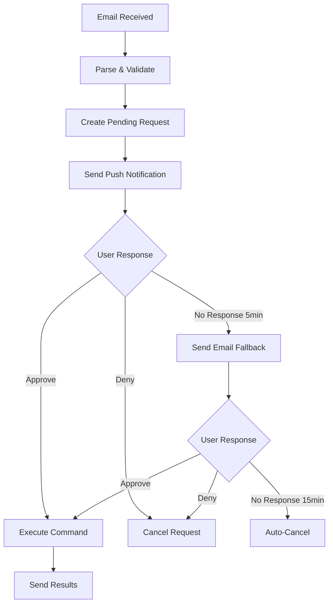

# Multi-Factor Confirmation System

This document outlines the 2FA-style confirmation system using push notifications and email for secure command execution.

## 🔐 Security Architecture

### Confirmation Flow Overview


## 📱 Push Notification System

### 1. Web Push API Integration

#### Service Worker Setup
```typescript
// apps/web-dashboard/public/sw.js
self.addEventListener('push', function(event) {
  if (event.data) {
    const data = event.data.json();

    const options = {
      body: data.body,
      icon: '/icons/icon-192x192.png',
      badge: '/icons/badge-72x72.png',
      actions: [
        {
          action: 'approve',
          title: '✅ Approve',
          icon: '/icons/approve.png'
        },
        {
          action: 'deny',
          title: '❌ Deny',
          icon: '/icons/deny.png'
        },
        {
          action: 'view',
          title: '👁️ View Details',
          icon: '/icons/view.png'
        }
      ],
      data: {
        requestId: data.requestId,
        url: data.url
      },
      requireInteraction: true, // Keep notification until user acts
      tag: `command-${data.requestId}` // Group related notifications
    };

    event.waitUntil(
      self.registration.showNotification(data.title, options)
    );
  }
});

// Handle notification clicks
self.addEventListener('notificationclick', function(event) {
  event.notification.close();

  if (event.action === 'approve') {
    event.waitUntil(
      fetch(`/api/v1/requests/${event.notification.data.requestId}/approve`, {
        method: 'POST',
        headers: {
          'Authorization': `Bearer ${getStoredToken()}`
        }
      })
    );
  } else if (event.action === 'deny') {
    event.waitUntil(
      fetch(`/api/v1/requests/${event.notification.data.requestId}/deny`, {
        method: 'POST',
        headers: {
          'Authorization': `Bearer ${getStoredToken()}`
        }
      })
    );
  } else {
    // Open dashboard
    event.waitUntil(
      clients.openWindow(event.notification.data.url || '/')
    );
  }
});
```

#### Push Notification Service
```typescript
// apps/api-gateway/src/services/push-notification.ts
import webpush from 'web-push';
import { prisma } from '@ai-dev/database';

export interface PushSubscription {
  userId: string;
  endpoint: string;
  keys: {
    p256dh: string;
    auth: string;
  };
  userAgent?: string;
  deviceName?: string;
}

export class PushNotificationService {
  constructor() {
    webpush.setVapidDetails(
      'mailto:admin@yourplatform.com',
      process.env.VAPID_PUBLIC_KEY!,
      process.env.VAPID_PRIVATE_KEY!
    );
  }

  async subscribeToPush(userId: string, subscription: any): Promise<void> {
    await prisma.pushSubscription.upsert({
      where: {
        userId_endpoint: {
          userId,
          endpoint: subscription.endpoint
        }
      },
      update: {
        p256dh: subscription.keys.p256dh,
        auth: subscription.keys.auth,
        isActive: true,
        lastUsed: new Date()
      },
      create: {
        userId,
        endpoint: subscription.endpoint,
        p256dh: subscription.keys.p256dh,
        auth: subscription.keys.auth,
        isActive: true,
        lastUsed: new Date()
      }
    });
  }

  async sendCommandConfirmation(requestId: string, userId: string): Promise<boolean> {
    const request = await prisma.request.findUnique({
      where: { id: requestId },
      include: { repository: true }
    });

    if (!request) throw new Error('Request not found');

    const subscriptions = await prisma.pushSubscription.findMany({
      where: { userId, isActive: true }
    });

    if (subscriptions.length === 0) {
      return false; // No push subscriptions, will fall back to email
    }

    const payload = {
      title: '🔐 Confirm Development Command',
      body: `"${this.truncateCommand(request.command)}" on ${request.repository?.name || 'unknown repo'}`,
      requestId,
      url: `/requests/${requestId}`,
      data: {
        type: 'command_confirmation',
        requestId,
        command: request.command,
        repository: request.repository?.name,
        timestamp: new Date().toISOString()
      }
    };

    let successCount = 0;

    // Send to all active devices
    for (const subscription of subscriptions) {
      try {
        await webpush.sendNotification(
          {
            endpoint: subscription.endpoint,
            keys: {
              p256dh: subscription.p256dh,
              auth: subscription.auth
            }
          },
          JSON.stringify(payload)
        );

        successCount++;

        // Update last used timestamp
        await prisma.pushSubscription.update({
          where: { id: subscription.id },
          data: { lastUsed: new Date() }
        });

      } catch (error) {
        console.error(`Failed to send push notification:`, error);

        // Deactivate failed subscriptions
        if (error.statusCode === 410) { // Gone - subscription expired
          await prisma.pushSubscription.update({
            where: { id: subscription.id },
            data: { isActive: false }
          });
        }
      }
    }

    return successCount > 0;
  }

  private truncateCommand(command: string, maxLength: number = 60): string {
    return command.length > maxLength
      ? command.substring(0, maxLength) + '...'
      : command;
  }
}
```

### 2. Dashboard Push Setup Component

```typescript
// apps/web-dashboard/src/components/notifications/push-setup.tsx
'use client';

import { useState, useEffect } from 'react';
import { Button } from '@/components/ui/button';
import { Card, CardContent, CardDescription, CardHeader, CardTitle } from '@/components/ui/card';
import { Alert, AlertDescription } from '@/components/ui/alert';
import { Bell, BellOff, Shield, Check } from 'lucide-react';

export function PushNotificationSetup() {
  const [permission, setPermission] = useState<NotificationPermission>('default');
  const [isSubscribed, setIsSubscribed] = useState(false);
  const [loading, setLoading] = useState(false);
  const [error, setError] = useState<string | null>(null);

  useEffect(() => {
    checkNotificationSupport();
    checkSubscriptionStatus();
  }, []);

  const checkNotificationSupport = () => {
    if ('Notification' in window) {
      setPermission(Notification.permission);
    }
  };

  const checkSubscriptionStatus = async () => {
    if ('serviceWorker' in navigator && 'PushManager' in window) {
      try {
        const registration = await navigator.serviceWorker.ready;
        const subscription = await registration.pushManager.getSubscription();
        setIsSubscribed(!!subscription);
      } catch (error) {
        console.error('Error checking subscription:', error);
      }
    }
  };

  const enablePushNotifications = async () => {
    setLoading(true);
    setError(null);

    try {
      // Request permission
      const permission = await Notification.requestPermission();
      setPermission(permission);

      if (permission !== 'granted') {
        throw new Error('Notification permission denied');
      }

      // Register service worker
      const registration = await navigator.serviceWorker.register('/sw.js');
      await navigator.serviceWorker.ready;

      // Get VAPID public key from server
      const vapidResponse = await fetch('/api/v1/notifications/vapid-key');
      const { publicKey } = await vapidResponse.json();

      // Subscribe to push notifications
      const subscription = await registration.pushManager.subscribe({
        userVisibleOnly: true,
        applicationServerKey: urlBase64ToUint8Array(publicKey)
      });

      // Send subscription to server
      const token = localStorage.getItem('auth_token');
      const response = await fetch('/api/v1/notifications/subscribe', {
        method: 'POST',
        headers: {
          'Content-Type': 'application/json',
          'Authorization': `Bearer ${token}`
        },
        body: JSON.stringify({
          subscription,
          deviceName: navigator.userAgent
        })
      });

      if (!response.ok) {
        throw new Error('Failed to save subscription');
      }

      setIsSubscribed(true);

      // Send test notification
      await fetch('/api/v1/notifications/test', {
        method: 'POST',
        headers: {
          'Authorization': `Bearer ${token}`
        }
      });

    } catch (error) {
      setError(error instanceof Error ? error.message : 'Failed to enable notifications');
    } finally {
      setLoading(false);
    }
  };

  const disablePushNotifications = async () => {
    setLoading(true);

    try {
      const registration = await navigator.serviceWorker.ready;
      const subscription = await registration.pushManager.getSubscription();

      if (subscription) {
        await subscription.unsubscribe();
      }

      const token = localStorage.getItem('auth_token');
      await fetch('/api/v1/notifications/unsubscribe', {
        method: 'POST',
        headers: {
          'Authorization': `Bearer ${token}`
        }
      });

      setIsSubscribed(false);
    } catch (error) {
      setError('Failed to disable notifications');
    } finally {
      setLoading(false);
    }
  };

  const urlBase64ToUint8Array = (base64String: string) => {
    const padding = '='.repeat((4 - base64String.length % 4) % 4);
    const base64 = (base64String + padding)
      .replace(/-/g, '+')
      .replace(/_/g, '/');

    const rawData = window.atob(base64);
    const outputArray = new Uint8Array(rawData.length);

    for (let i = 0; i < rawData.length; ++i) {
      outputArray[i] = rawData.charCodeAt(i);
    }
    return outputArray;
  };

  if (!('Notification' in window)) {
    return (
      <Alert variant="destructive">
        <AlertDescription>
          Push notifications are not supported in this browser.
        </AlertDescription>
      </Alert>
    );
  }

  return (
    <Card>
      <CardHeader>
        <CardTitle className="flex items-center">
          <Shield className="h-5 w-5 mr-2" />
          Security Confirmations
        </CardTitle>
        <CardDescription>
          Enable push notifications for instant command confirmation (recommended for security)
        </CardDescription>
      </CardHeader>
      <CardContent className="space-y-4">
        {error && (
          <Alert variant="destructive">
            <AlertDescription>{error}</AlertDescription>
          </Alert>
        )}

        <div className="flex items-center justify-between p-4 border rounded-lg">
          <div className="flex items-center space-x-3">
            {isSubscribed ? (
              <Bell className="h-5 w-5 text-green-500" />
            ) : (
              <BellOff className="h-5 w-5 text-gray-400" />
            )}
            <div>
              <p className="font-medium">
                Push Notifications
              </p>
              <p className="text-sm text-gray-600">
                {isSubscribed
                  ? 'Enabled - You\'ll receive instant confirmations'
                  : 'Disabled - Commands will require email confirmation (slower)'
                }
              </p>
            </div>
          </div>

          <Button
            onClick={isSubscribed ? disablePushNotifications : enablePushNotifications}
            disabled={loading}
            variant={isSubscribed ? "outline" : "default"}
          >
            {loading ? (
              'Working...'
            ) : isSubscribed ? (
              'Disable'
            ) : (
              'Enable'
            )}
          </Button>
        </div>

        <div className="space-y-2 text-sm text-gray-600">
          <h4 className="font-medium text-gray-900">How it works:</h4>
          <ul className="space-y-1">
            <li>• Commands sent via email trigger instant push notifications</li>
            <li>• Approve or deny directly from the notification</li>
            <li>• Email fallback if you don't respond within 5 minutes</li>
            <li>• Auto-cancel if no response within 15 minutes</li>
          </ul>
        </div>

        {isSubscribed && (
          <div className="flex items-center space-x-2 text-sm text-green-600">
            <Check className="h-4 w-4" />
            <span>Your device is registered for secure confirmations</span>
          </div>
        )}
      </CardContent>
    </Card>
  );
}
```

## 📧 Email Confirmation Fallback

### 1. Email Confirmation Template
```typescript
// apps/api-gateway/src/services/email-confirmation.ts
export class EmailConfirmationService {
  generateConfirmationEmail(request: any): EmailTemplate {
    const approveUrl = `${process.env.FRONTEND_URL}/confirm/${request.id}?action=approve&token=${request.confirmationToken}`;
    const denyUrl = `${process.env.FRONTEND_URL}/confirm/${request.id}?action=deny&token=${request.confirmationToken}`;

    const html = `
    <!DOCTYPE html>
    <html>
    <head>
      <style>
        .container { max-width: 600px; margin: 0 auto; font-family: Arial, sans-serif; }
        .header { background: #ff6b35; color: white; padding: 20px; text-align: center; }
        .content { padding: 30px; background: #f8f9fa; }
        .command-box { background: #1e1e1e; color: #fff; padding: 15px; border-radius: 5px; font-family: monospace; margin: 20px 0; }
        .actions { text-align: center; margin: 30px 0; }
        .btn { display: inline-block; padding: 12px 30px; margin: 0 10px; text-decoration: none; border-radius: 5px; font-weight: bold; }
        .approve { background: #28a745; color: white; }
        .deny { background: #dc3545; color: white; }
        .warning { background: #fff3cd; border-left: 4px solid #ffc107; padding: 15px; margin: 20px 0; }
      </style>
    </head>
    <body>
      <div class="container">
        <div class="header">
          <h1>🔐 Confirm Development Command</h1>
          <p>Security confirmation required</p>
        </div>

        <div class="content">
          <div class="warning">
            <strong>⚠️ Security Notice:</strong> A development command was requested for your repository.
            Please review carefully before approving.
          </div>

          <h3>Command Details:</h3>
          <p><strong>Repository:</strong> ${request.repository?.name || 'Unknown'}</p>
          <p><strong>Requested at:</strong> ${new Date(request.createdAt).toLocaleString()}</p>
          <p><strong>Source:</strong> ${request.source}</p>

          <h4>Command to execute:</h4>
          <div class="command-box">${request.command}</div>

          <div class="warning">
            <strong>What will happen if approved:</strong>
            <ul>
              <li>A fresh container will be created with your repository code</li>
              <li>Claude Code will execute the command in the repository context</li>
              <li>Results will be sent back to you via email</li>
              <li>The container will be automatically cleaned up after 2 hours</li>
            </ul>
          </div>

          <div class="actions">
            <a href="${approveUrl}" class="btn approve">
              ✅ APPROVE & EXECUTE
            </a>
            <a href="${denyUrl}" class="btn deny">
              ❌ DENY & CANCEL
            </a>
          </div>

          <hr style="margin: 30px 0;">

          <h4>🛡️ Security Tips:</h4>
          <ul>
            <li>Only approve commands you initiated or trust</li>
            <li>Review the command carefully for any suspicious content</li>
            <li>If you didn't request this, click DENY immediately</li>
            <li>This confirmation expires in 15 minutes</li>
          </ul>

          <p style="color: #666; font-size: 0.9em; margin-top: 30px;">
            <strong>Request ID:</strong> ${request.id}<br>
            <strong>Expires:</strong> ${new Date(request.expiresAt).toLocaleString()}
          </p>
        </div>
      </div>
    </body>
    </html>
    `;

    return {
      subject: `🔐 Confirm: "${this.truncateCommand(request.command)}" on ${request.repository?.name}`,
      html,
      text: this.htmlToText(html)
    };
  }
}
```

### 2. Confirmation Handling Routes
```typescript
// apps/api-gateway/src/routes/confirmation.ts
import { Router } from 'express';
import { prisma } from '@ai-dev/database';
import { executionQueue } from '../queues';

export const confirmationRouter = Router();

// Approve command execution
confirmationRouter.post('/requests/:requestId/approve', authenticateToken, async (req, res) => {
  try {
    const { requestId } = req.params;
    const { userId } = (req as AuthenticatedRequest).user;

    const request = await prisma.request.findFirst({
      where: {
        id: requestId,
        userId,
        status: 'PENDING_CONFIRMATION',
        expiresAt: { gt: new Date() }
      },
      include: { repository: true }
    });

    if (!request) {
      return res.status(404).json({
        success: false,
        error: 'Request not found or expired'
      });
    }

    // Update request status
    await prisma.request.update({
      where: { id: requestId },
      data: {
        status: 'CONFIRMED',
        confirmedAt: new Date()
      }
    });

    // Queue for execution
    await executionQueue.add('execute-with-repository', {
      requestId,
      userId,
      command: request.command,
      repositoryId: request.repositoryId,
      repositoryName: request.repository?.name,
      repositoryUrl: request.repository?.cloneUrl,
      branch: 'main' // Could be extracted from request
    });

    res.json({
      success: true,
      message: 'Command approved and queued for execution'
    });

  } catch (error) {
    console.error('Approval error:', error);
    res.status(500).json({
      success: false,
      error: 'Failed to approve request'
    });
  }
});

// Deny command execution
confirmationRouter.post('/requests/:requestId/deny', authenticateToken, async (req, res) => {
  try {
    const { requestId } = req.params;
    const { userId } = (req as AuthenticatedRequest).user;

    const request = await prisma.request.findFirst({
      where: {
        id: requestId,
        userId,
        status: 'PENDING_CONFIRMATION'
      }
    });

    if (!request) {
      return res.status(404).json({
        success: false,
        error: 'Request not found'
      });
    }

    // Update request status
    await prisma.request.update({
      where: { id: requestId },
      data: {
        status: 'DENIED',
        completedAt: new Date()
      }
    });

    res.json({
      success: true,
      message: 'Command denied successfully'
    });

  } catch (error) {
    console.error('Denial error:', error);
    res.status(500).json({
      success: false,
      error: 'Failed to deny request'
    });
  }
});

// Web confirmation page (for email links)
confirmationRouter.get('/confirm/:requestId', async (req, res) => {
  const { requestId } = req.params;
  const { action, token } = req.query;

  try {
    const request = await prisma.request.findUnique({
      where: { id: requestId },
      include: { repository: true }
    });

    if (!request || request.confirmationToken !== token) {
      return res.status(404).send('Invalid or expired confirmation link');
    }

    if (request.status !== 'PENDING_CONFIRMATION') {
      return res.status(400).send('Request already processed');
    }

    if (action === 'approve') {
      // Handle approval
      await prisma.request.update({
        where: { id: requestId },
        data: { status: 'CONFIRMED', confirmedAt: new Date() }
      });

      // Queue for execution
      await executionQueue.add('execute-with-repository', {
        requestId,
        userId: request.userId,
        command: request.command,
        repositoryName: request.repository?.name,
        repositoryUrl: request.repository?.cloneUrl
      });

      res.send(`
        <html>
          <body style="font-family: Arial, sans-serif; text-align: center; padding: 50px;">
            <h1>✅ Command Approved</h1>
            <p>Your development command has been approved and is being executed.</p>
            <p>You'll receive the results via email shortly.</p>
          </body>
        </html>
      `);

    } else if (action === 'deny') {
      // Handle denial
      await prisma.request.update({
        where: { id: requestId },
        data: { status: 'DENIED', completedAt: new Date() }
      });

      res.send(`
        <html>
          <body style="font-family: Arial, sans-serif; text-align: center; padding: 50px;">
            <h1>❌ Command Denied</h1>
            <p>The development command has been denied and will not be executed.</p>
          </body>
        </html>
      `);
    }

  } catch (error) {
    console.error('Confirmation error:', error);
    res.status(500).send('Internal server error');
  }
});
```

## ⏰ Timeout & Escalation System

### 1. Confirmation Timeout Handler
```typescript
// apps/api-gateway/src/queues/confirmation-processor.ts
export class ConfirmationProcessor {
  // Process pending confirmations
  async setupConfirmationTimeouts(): Promise<void> {
    // Check every minute for expired confirmations
    setInterval(async () => {
      await this.processExpiredConfirmations();
    }, 60000);

    // Check every 30 seconds for push notification fallbacks
    setInterval(async () => {
      await this.processPushNotificationFallbacks();
    }, 30000);
  }

  private async processPushNotificationFallbacks(): Promise<void> {
    const fiveMinutesAgo = new Date(Date.now() - 5 * 60 * 1000);

    const pendingRequests = await prisma.request.findMany({
      where: {
        status: 'PENDING_CONFIRMATION',
        createdAt: { lt: fiveMinutesAgo },
        emailFallbackSent: false
      },
      include: { user: true, repository: true }
    });

    for (const request of pendingRequests) {
      // Send email fallback
      await this.emailConfirmationService.sendConfirmationEmail(request);

      // Mark fallback as sent
      await prisma.request.update({
        where: { id: request.id },
        data: { emailFallbackSent: true }
      });
    }
  }

  private async processExpiredConfirmations(): Promise<void> {
    const expiredRequests = await prisma.request.findMany({
      where: {
        status: 'PENDING_CONFIRMATION',
        expiresAt: { lt: new Date() }
      },
      include: { user: true }
    });

    for (const request of expiredRequests) {
      // Mark as expired
      await prisma.request.update({
        where: { id: request.id },
        data: {
          status: 'EXPIRED',
          completedAt: new Date()
        }
      });

      // Notify user of expiration
      await this.emailService.sendExpirationNotice(request);
    }
  }
}
```

## 🔧 Integration with Existing Email Webhook

Update the email webhook to create pending requests:

```typescript
// In apps/api-gateway/src/routes/email-webhook.ts
emailWebhookRouter.post('/incoming', async (req, res) => {
  // ... existing parsing logic ...

  // Create pending request with confirmation token
  const confirmationToken = crypto.randomBytes(32).toString('hex');
  const expiresAt = new Date(Date.now() + 15 * 60 * 1000); // 15 minutes

  const request = await prisma.request.create({
    data: {
      userId: user.id,
      command: cleanedBody,
      source: from,
      repositoryId: repository?.id,
      status: 'PENDING_CONFIRMATION',
      confirmationToken,
      expiresAt,
      emailFallbackSent: false
    },
    include: { repository: true }
  });

  // Try push notification first
  const pushSent = await pushNotificationService.sendCommandConfirmation(request.id, user.id);

  // If no push subscriptions, send email immediately
  if (!pushSent) {
    await emailConfirmationService.sendConfirmationEmail(request);
    await prisma.request.update({
      where: { id: request.id },
      data: { emailFallbackSent: true }
    });
  }

  res.json({ success: true, message: 'Confirmation sent' });
});
```

This creates a robust 2FA-style confirmation system that prioritizes fast push notifications while ensuring reliable email fallback for security!