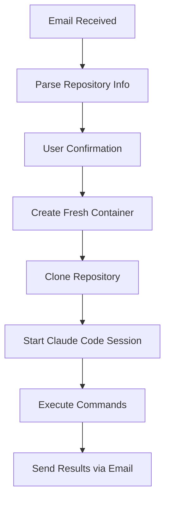

# Container Architecture & Email Output System

This document explains how the AI Development Assistant Platform creates persistent development containers and handles email communication.

## 🐳 Persistent Container System

### Container Lifecycle

#### 1. Container Creation Flow


#### 2. Container Manager Implementation

The container system is built on Docker with custom orchestration:

```typescript
// Container creation process
class ContainerManager {
  async createUserContainer(userId: string, options: ContainerOptions): Promise<string> {
    const containerName = `ai-dev-${userId}-${Date.now()}`;

    // Create container with Claude Code pre-installed
    const container = await this.docker.createContainer({
      Image: 'ai-dev-base:latest', // Custom image with Claude Code CLI
      name: containerName,
      Env: [
        `USER_ID=${userId}`,
        `REPOSITORY_NAME=${options.repositoryName}`,
        `WORKSPACE_PATH=/workspace/${options.repositoryName}`,
        ...options.environment
      ],
      WorkingDir: options.workDir || '/workspace',
      HostConfig: {
        Memory: 2 * 1024 * 1024 * 1024, // 2GB RAM limit
        CpuShares: 1024, // CPU limit
        Tmpfs: { '/tmp': 'size=512m' }, // Temporary filesystem
        NetworkMode: 'ai-dev-network', // Isolated network
      },
      Volumes: {
        [`${containerName}-workspace`]: {}
      }
    });

    await container.start();

    // Wait for container to be ready
    await this.waitForContainer(container.id);

    return container.id;
  }
}
```

#### 3. Base Container Image

```dockerfile
# Dockerfile for ai-dev-base:latest
FROM ubuntu:22.04

# Install system dependencies
RUN apt-get update && apt-get install -y \
    git \
    curl \
    wget \
    vim \
    tmux \
    nodejs \
    npm \
    python3 \
    python3-pip \
    && rm -rf /var/lib/apt/lists/*

# Install Claude Code CLI
RUN npm install -g @anthropic/claude-code

# Create workspace directory
RUN mkdir -p /workspace
WORKDIR /workspace

# Setup user environment
RUN useradd -m -s /bin/bash developer
RUN chown -R developer:developer /workspace

# Install common development tools
RUN npm install -g typescript ts-node
RUN pip3 install requests beautifulsoup4

# Setup tmux configuration for persistent sessions
COPY tmux.conf /home/developer/.tmux.conf

USER developer
EXPOSE 3000 8080

CMD ["tail", "-f", "/dev/null"]
```

### Repository Cloning & Setup

#### 1. Repository Cloning Process
```typescript
async cloneRepository(containerId: string, repositoryUrl: string, branch: string = 'main'): Promise<void> {
  const commands = [
    'bash', '-c', `
      cd /workspace &&
      git clone -b ${branch} ${repositoryUrl} ${repositoryName} &&
      cd ${repositoryName} &&
      git config user.email "ai@dev.platform" &&
      git config user.name "AI Dev Assistant" &&

      # Install dependencies if package.json exists
      if [ -f package.json ]; then
        npm install
      fi &&

      # Install Python dependencies if requirements.txt exists
      if [ -f requirements.txt ]; then
        pip3 install -r requirements.txt
      fi &&

      # Make directory accessible
      chmod -R 755 .
    `
  ];

  await this.executeCommand(containerId, commands);
}
```

#### 2. Claude Code Session Management
```typescript
class TmuxSessionManager {
  async createClaudeCodeSession(userId: string, repositoryPath: string): Promise<string> {
    const sessionName = `claude-code-${userId}-${Date.now()}`;

    // Create tmux session with Claude Code
    const commands = [
      'tmux', 'new-session', '-d', '-s', sessionName,
      '-c', repositoryPath,
      'claude-code'
    ];

    await this.containerManager.executeCommand(userId, commands);

    // Wait for Claude Code to initialize
    await this.waitForClaudeCodeReady(sessionName);

    return sessionName;
  }

  async sendCommandToSession(sessionId: string, command: string): Promise<void> {
    // Send command to Claude Code session
    const tmuxCommand = [
      'tmux', 'send-keys', '-t', sessionId,
      command, 'Enter'
    ];

    await this.containerManager.executeCommand(
      this.getUserIdFromSession(sessionId),
      tmuxCommand
    );
  }

  async captureSessionOutput(sessionId: string): Promise<string> {
    // Capture output from tmux session
    const captureCommand = [
      'tmux', 'capture-pane', '-t', sessionId, '-p'
    ];

    const result = await this.containerManager.executeCommand(
      this.getUserIdFromSession(sessionId),
      captureCommand
    );

    return result.output;
  }
}
```

### Container Persistence & Cleanup

#### 1. Session Persistence
- **Tmux Sessions**: Persist across container restarts
- **File Changes**: Stored in named Docker volumes
- **Git State**: Maintained with proper git configuration
- **Environment**: Preserved through container lifecycle

#### 2. Cleanup Strategy
```typescript
class ContainerLifecycleManager {
  // Cleanup idle containers after 2 hours of inactivity
  async cleanupIdleContainers(): Promise<void> {
    const idleThreshold = 2 * 60 * 60 * 1000; // 2 hours
    const now = Date.now();

    const containers = await this.getActiveContainers();

    for (const container of containers) {
      const lastActivity = await this.getLastActivity(container.id);

      if (now - lastActivity > idleThreshold) {
        await this.gracefulShutdown(container.id);
      }
    }
  }

  async gracefulShutdown(containerId: string): Promise<void> {
    // Save session state
    await this.saveSessionState(containerId);

    // Commit any changes
    await this.commitChanges(containerId);

    // Stop container
    await this.docker.getContainer(containerId).stop();

    // Remove container (volumes persist)
    await this.docker.getContainer(containerId).remove();
  }
}
```

## 📧 Email Output System

### Email Communication Flow

#### 1. Output Capture & Processing
```typescript
class EmailOutputProcessor {
  async processCommandOutput(sessionId: string, command: string): Promise<EmailOutput> {
    const startTime = Date.now();
    let output = '';
    let isComplete = false;

    // Monitor session output in real-time
    while (!isComplete && (Date.now() - startTime) < 300000) { // 5 min timeout
      const newOutput = await this.tmuxManager.captureSessionOutput(sessionId);

      if (this.isCommandComplete(newOutput, command)) {
        isComplete = true;
        output = newOutput;
      }

      await this.sleep(1000); // Check every second
    }

    return this.formatOutput(output, command, isComplete);
  }

  private formatOutput(rawOutput: string, command: string, completed: boolean): EmailOutput {
    return {
      command,
      output: this.cleanOutput(rawOutput),
      completed,
      timestamp: new Date().toISOString(),
      formattedHtml: this.convertToHtml(rawOutput),
      summary: this.generateSummary(rawOutput, command)
    };
  }
}
```

#### 2. Email Template System
```typescript
interface EmailTemplate {
  subject: string;
  html: string;
  text: string;
}

class EmailTemplateService {
  generateCompletionEmail(output: EmailOutput, repository: string): EmailTemplate {
    const subject = `✅ [${repository}] Command completed: ${output.command}`;

    const html = `
    <!DOCTYPE html>
    <html>
    <head>
      <style>
        .container { max-width: 800px; margin: 0 auto; font-family: Arial, sans-serif; }
        .header { background: #f8f9fa; padding: 20px; border-radius: 8px; margin-bottom: 20px; }
        .output { background: #1e1e1e; color: #fff; padding: 15px; border-radius: 5px; overflow-x: auto; }
        .summary { background: #e3f2fd; padding: 15px; border-radius: 5px; margin: 20px 0; }
        .metadata { color: #666; font-size: 0.9em; margin-top: 20px; }
      </style>
    </head>
    <body>
      <div class="container">
        <div class="header">
          <h2>🤖 AI Development Assistant</h2>
          <p><strong>Repository:</strong> ${repository}</p>
          <p><strong>Command:</strong> ${output.command}</p>
          <p><strong>Status:</strong> ${output.completed ? '✅ Completed' : '⏱️ Timed out'}</p>
        </div>

        ${output.summary ? `
        <div class="summary">
          <h3>📋 Summary</h3>
          <p>${output.summary}</p>
        </div>
        ` : ''}

        <div>
          <h3>💻 Output</h3>
          <pre class="output">${this.escapeHtml(output.output)}</pre>
        </div>

        <div class="metadata">
          <p><strong>Timestamp:</strong> ${output.timestamp}</p>
          <p><strong>Session ID:</strong> ${sessionId}</p>
        </div>

        <hr style="margin: 30px 0;">
        <p style="color: #666; font-size: 0.9em;">
          To send another command, reply to this email or send a new email to ${userEmail}
        </p>
      </div>
    </body>
    </html>
    `;

    const text = `
AI Development Assistant - Command Completed

Repository: ${repository}
Command: ${output.command}
Status: ${output.completed ? 'Completed' : 'Timed out'}

${output.summary ? `Summary:\n${output.summary}\n\n` : ''}

Output:
${output.output}

Timestamp: ${output.timestamp}
Session ID: ${sessionId}

To send another command, reply to this email or send a new email to ${userEmail}
    `;

    return { subject, html, text };
  }

  generateErrorEmail(error: string, command: string, repository: string): EmailTemplate {
    const subject = `❌ [${repository}] Command failed: ${command}`;

    const html = `
    <div style="max-width: 600px; margin: 0 auto; font-family: Arial, sans-serif;">
      <div style="background: #ffe6e6; padding: 20px; border-radius: 8px; border-left: 4px solid #ff4444;">
        <h2 style="color: #cc0000;">❌ Command Failed</h2>
        <p><strong>Repository:</strong> ${repository}</p>
        <p><strong>Command:</strong> ${command}</p>
        <p><strong>Error:</strong></p>
        <pre style="background: #f5f5f5; padding: 10px; border-radius: 4px; overflow-x: auto;">${error}</pre>
      </div>

      <div style="margin-top: 20px; padding: 15px; background: #f8f9fa; border-radius: 8px;">
        <h3>🛠️ Troubleshooting Tips</h3>
        <ul>
          <li>Check if the command syntax is correct</li>
          <li>Verify that required dependencies are installed</li>
          <li>Ensure you have necessary permissions</li>
          <li>Try breaking complex commands into smaller steps</li>
        </ul>
      </div>

      <p style="margin-top: 20px; color: #666;">
        You can try again by sending another email with a corrected command.
      </p>
    </div>
    `;

    return { subject, html, text: this.htmlToText(html) };
  }
}
```

#### 3. Email Delivery System
```typescript
class EmailDeliveryService {
  async sendCommandResult(
    userEmail: string,
    output: EmailOutput,
    repository: string,
    sessionId: string
  ): Promise<void> {
    const template = this.templateService.generateCompletionEmail(output, repository);

    // Add tracking and metadata
    const emailData = {
      to: userEmail,
      from: 'ai-assistant@yourplatform.com',
      subject: template.subject,
      html: template.html,
      text: template.text,
      headers: {
        'X-Session-ID': sessionId,
        'X-Repository': repository,
        'X-Command': output.command,
        'X-Status': output.completed ? 'completed' : 'timeout'
      },
      attachments: this.shouldAttachFiles(output) ? await this.createAttachments(sessionId) : []
    };

    // Send via queue for reliability
    await this.emailQueue.add('send-result', emailData, {
      attempts: 3,
      backoff: {
        type: 'exponential',
        delay: 2000
      }
    });
  }

  private async createAttachments(sessionId: string): Promise<Attachment[]> {
    const attachments: Attachment[] = [];

    // Attach created/modified files
    const changedFiles = await this.getChangedFiles(sessionId);

    for (const file of changedFiles) {
      if (file.size < 1024 * 1024) { // Max 1MB per file
        attachments.push({
          filename: path.basename(file.path),
          content: await this.getFileContent(sessionId, file.path),
          contentType: this.getMimeType(file.path)
        });
      }
    }

    return attachments;
  }
}
```

### Real-time Output Streaming

#### 1. WebSocket Integration (Optional)
```typescript
// For users who want real-time updates
class RealtimeOutputService {
  async streamOutput(sessionId: string, userEmail: string): Promise<void> {
    const ws = this.websocketManager.getConnection(userEmail);

    if (ws) {
      // Stream output in real-time via WebSocket
      const outputStream = this.tmuxManager.createOutputStream(sessionId);

      outputStream.on('data', (chunk) => {
        ws.send(JSON.stringify({
          type: 'output',
          sessionId,
          data: chunk.toString()
        }));
      });

      outputStream.on('end', () => {
        ws.send(JSON.stringify({
          type: 'complete',
          sessionId
        }));
      });
    }
  }
}
```

#### 2. Progressive Email Updates
```typescript
// For long-running commands, send progress updates
class ProgressiveEmailService {
  async sendProgressUpdate(sessionId: string, userEmail: string, progress: string): Promise<void> {
    const subject = `🔄 [${repository}] Command in progress...`;

    const html = `
    <div style="max-width: 600px; margin: 0 auto; font-family: Arial, sans-serif;">
      <div style="background: #fff3cd; padding: 20px; border-radius: 8px; border-left: 4px solid #ffc107;">
        <h3>🔄 Command in Progress</h3>
        <p><strong>Latest output:</strong></p>
        <pre style="background: #f8f9fa; padding: 10px; border-radius: 4px;">${progress}</pre>
        <p style="color: #666; font-size: 0.9em;">
          You will receive the final result when the command completes.
        </p>
      </div>
    </div>
    `;

    await this.emailQueue.add('send-progress', {
      to: userEmail,
      subject,
      html,
      headers: { 'X-Update-Type': 'progress' }
    });
  }
}
```

## 🔄 Complete Workflow Example

### Email → Container → Result Flow

1. **Email Received**: `"[my-app] Add user authentication with JWT"`
2. **Container Created**: Fresh Ubuntu container with Claude Code
3. **Repository Cloned**: User's `my-app` repository cloned to `/workspace/my-app`
4. **Session Started**: Tmux session with Claude Code CLI in repository directory
5. **Command Executed**: Claude Code processes the authentication request
6. **Output Captured**: All terminal output, file changes, and results captured
7. **Email Sent**: Formatted results sent back to user with:
   - Summary of changes made
   - Code snippets created/modified
   - Any error messages or warnings
   - Attachments for new files (if small enough)

### Container Resources & Limits

- **Memory**: 2GB per container
- **CPU**: 1 CPU core shared
- **Disk**: 10GB workspace volume
- **Network**: Isolated network with internet access
- **Timeout**: 5 minutes per command, 2 hours container idle time
- **Concurrency**: Max 5 containers per user

This architecture ensures isolated, persistent development environments while providing comprehensive email-based communication for all development activities.