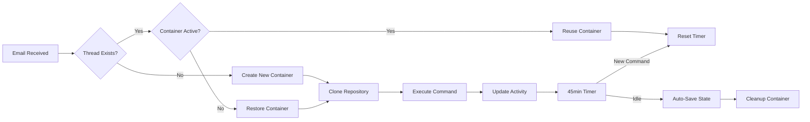

# Container Lifecycle Management Guide

This guide explains the intelligent container lifecycle management system that keeps development environments persistent during conversations while automatically cleaning up idle resources.

## 🎯 Key Features

### Thread-Based Container Persistence
- **One container per email thread**: Each email conversation gets its own dedicated container
- **45-minute idle timeout**: Containers stay alive for 45 minutes after the last command
- **Automatic state preservation**: Work is auto-committed before cleanup
- **Seamless restoration**: Containers are restored when conversations resume

## 🔄 Container Lifecycle Flow



## 📧 Thread Identification

The system identifies threads using:

1. **Email-based threads**: `sender@email.com-repository-name`
2. **Subject line continuity**: Same subject = same thread
3. **Repository context**: Each repository gets its own container per sender

### Examples

```
Thread ID: john@example.com-my-react-app
- All emails from John about my-react-app share this container
- Container persists between emails in the conversation
- State is maintained across multiple commands
```

## ⏱️ Timing and Lifecycle

### Active Phase (0-45 minutes)
- Container is running and ready
- Commands execute immediately
- No startup overhead
- Git state preserved
- All files and changes intact

### Warning Phase (40-45 minutes)
- System sends idle warning
- Option to extend lifetime
- Automatic save initiated

### Cleanup Phase (After 45 minutes)
- Container state saved to git
- Commit created with all changes
- Container stopped and removed
- Resources freed
- State stored for restoration

## 💾 State Management

### Automatic State Preservation

When a container is about to be cleaned up, the system:

1. **Checks for modifications**
```bash
git status --porcelain
```

2. **Commits all changes**
```bash
git add -A
git commit -m "Auto-save: Container cleanup after idle timeout

Thread: john@example.com-my-react-app
Timestamp: 2024-01-20T10:30:00Z
Files modified: 12

This commit was automatically created when the container was cleaned up."
```

3. **Stores commit reference**
- Commit hash saved in Redis
- Associated with thread ID
- Preserved for 7 days

### State Restoration

When a thread resumes after cleanup:

1. **New container created**
2. **Repository cloned**
3. **State restored from last commit**
```bash
git reset --hard <saved-commit-hash>
```
4. **Work continues seamlessly**

## 🛠️ Management Commands

### Via Dashboard

The Container Monitor component shows:
- Active containers and their threads
- Time remaining before cleanup
- Idle time for each container
- Options to extend or force cleanup

### Via API

```bash
# Get active sessions
GET /api/v1/containers/sessions

# Extend container lifetime (resets 45-minute timer)
POST /api/v1/containers/{containerId}/extend

# Force cleanup
POST /api/v1/containers/{containerId}/cleanup

# Get statistics
GET /api/v1/containers/stats
```

## 📊 Resource Management

### Container Limits
- **Memory**: 2GB per container
- **CPU**: 1 CPU core (shared)
- **Disk**: 10GB workspace volume
- **Network**: Isolated with internet access

### Concurrency
- **Max containers per user**: 5 active
- **Max threads**: Unlimited (but only active ones have containers)
- **Cleanup priority**: Oldest idle containers first

## 🔍 Monitoring and Events

### Lifecycle Events

The system emits events for monitoring:

```javascript
containerLifecycleManager.on('container:created', (data) => {
  console.log(`Container ${data.containerId} created for thread ${data.threadId}`);
});

containerLifecycleManager.on('container:idle-warning', (data) => {
  console.log(`Container ${data.containerId} has ${data.minutesRemaining} minutes remaining`);
});

containerLifecycleManager.on('container:cleaned', (data) => {
  console.log(`Container ${data.containerId} cleaned after ${data.idleMinutes} minutes idle`);
});
```

### Database Tracking

Container sessions are tracked in the database:

```sql
-- Active containers
SELECT * FROM container_sessions WHERE is_active = true;

-- Idle containers
SELECT * FROM container_sessions
WHERE last_activity_at < NOW() - INTERVAL '30 minutes'
AND is_active = true;

-- Container history
SELECT * FROM container_sessions
WHERE user_id = ?
ORDER BY created_at DESC;
```

## 🎯 Use Cases

### Long Development Session
```
10:00 - Email: "Create user authentication"
10:01 - Container created, command executed
10:30 - Email: "Add password reset"
10:31 - Same container used, state preserved
11:00 - Email: "Add email verification"
11:01 - Same container, all previous work intact
11:46 - No activity for 45 minutes
11:47 - Container auto-saved and cleaned up
```

### Resumed Conversation
```
Day 1, 14:00 - Email: "Setup React project"
Day 1, 14:01 - Container A created
Day 1, 14:30 - Last command
Day 1, 15:15 - Container A cleaned (45 min idle)

Day 2, 09:00 - Reply to thread: "Add routing"
Day 2, 09:01 - Container B created
Day 2, 09:02 - Previous state restored
Day 2, 09:03 - Routing added to existing project
```

## 🔧 Configuration

### Environment Variables
```bash
# Container lifecycle settings
CONTAINER_IDLE_TIMEOUT_MS=2700000  # 45 minutes in ms
CONTAINER_CHECK_INTERVAL_MS=60000   # Check every minute
CONTAINER_GRACE_PERIOD_MS=300000    # 5 minute warning
CONTAINER_MAX_PER_USER=5
```

### Customization Options

```typescript
// Adjust timeout per user or repository
const customTimeout = user.isPremium ? 120 : 45; // Premium users get 2 hours

// Repository-specific settings
const repoSettings = {
  'critical-project': { timeout: 180 },  // 3 hours for critical projects
  'demo-project': { timeout: 15 }        // 15 minutes for demos
};
```

## 🚨 Important Notes

### Data Persistence
- **All work is auto-saved** before cleanup
- **Commits are automatic** - no manual saving needed
- **State is preserved** for 7 days after cleanup

### Performance Optimization
- **Containers are reused** within threads
- **No cold starts** during active conversations
- **Instant command execution** in warm containers

### Security
- **Isolated environments** per thread
- **No cross-contamination** between users
- **Automatic cleanup** prevents resource abuse

## 📈 Benefits

1. **Cost Optimization**: Resources only used when active
2. **Performance**: No startup delay during conversations
3. **Persistence**: Work preserved across messages
4. **Security**: Isolated environments with automatic cleanup
5. **Scalability**: Automatic resource management

## 🔍 Troubleshooting

### Container Not Reusing
- Check thread ID consistency
- Verify container is within 45-minute window
- Ensure repository name matches

### State Not Restored
- Check if changes were committed
- Verify commit hash in Redis
- Look for git errors in logs

### Premature Cleanup
- Check system clock synchronization
- Verify timeout configuration
- Look for activity update failures

### Commands to Debug

```bash
# Check active containers
docker ps | grep ai-dev

# View container logs
docker logs <container-id>

# Check git state in container
docker exec <container-id> git status

# View saved states in Redis
redis-cli GET "container:state:thread-id"
```

This intelligent lifecycle management ensures optimal resource usage while providing a seamless development experience!